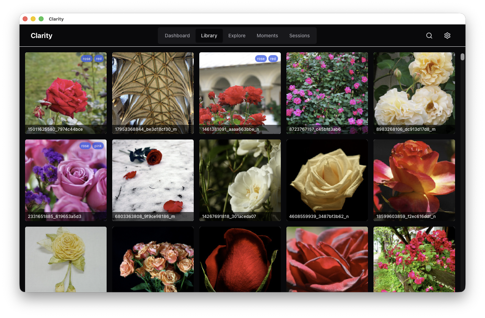
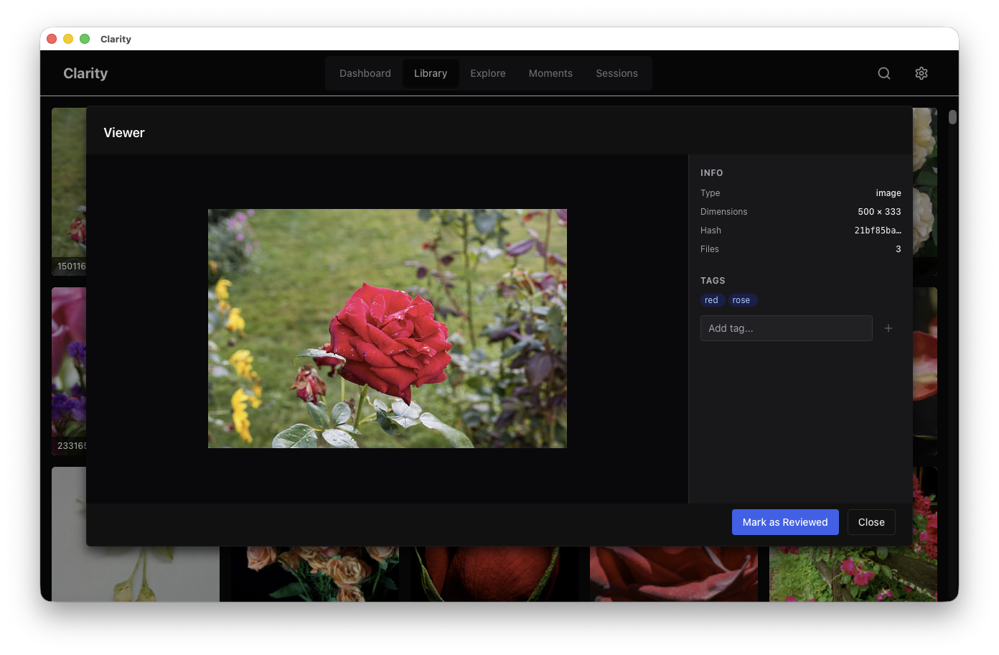
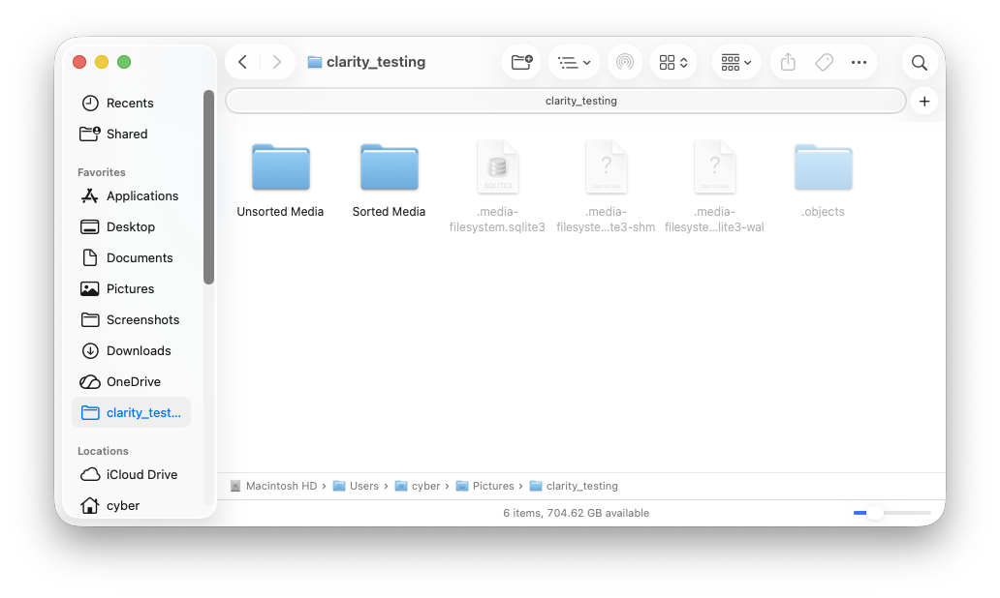
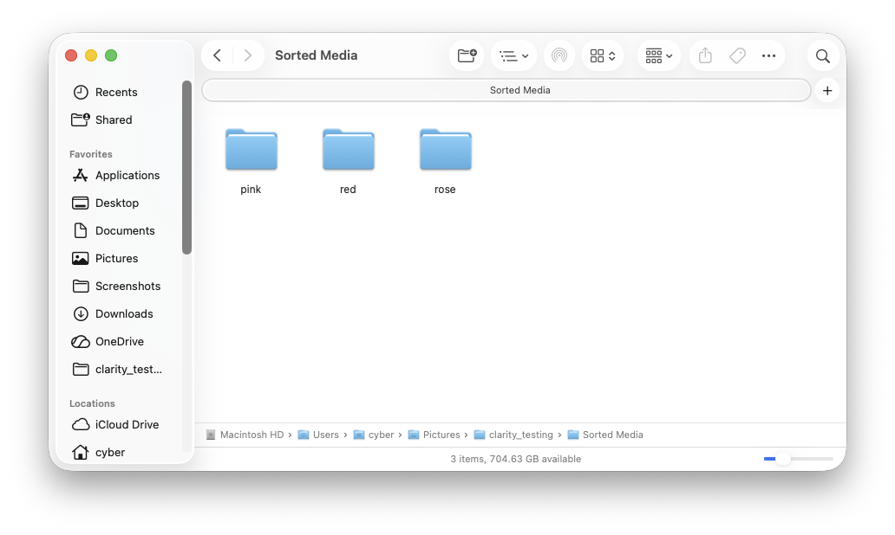

# Clarity

Clarity is a high-performance, local-first media management application designed to give you absolute control over your library. Unlike traditional media managers that lock your organization inside a proprietary database, Clarity's core philosophy is **filesystem-first portability**. 

It ensures that your organization is never dependent on the app itself by using hardlinks to mirror your library's structure on the physical disk. Whether you are using the app or browsing via a standard file explorer, your files remain organized, deduplicated, and instantly accessible.

---

## Demo

See Clarity in action:

https://github.com/user-attachments/assets/454a16af-f824-45b4-9251-76104ffa9a01

---

## Key Features

### Performance-Driven Ingest
*   **Fast Initial Ingest**: A two-phase pipeline separates filesystem scanning from intensive processing. The UI populates instantly after a scan, while heavy tasks run in the background.
*   **Parallel Background Processing**: A multi-threaded job system leverages your CPU cores to handle hashing, metadata extraction, and WebP thumbnail generation in parallel.

### Filesystem-Level Organization
*   **Hardlink-Based Management**: Uses content-based hashing (BLAKE3) and hardlinks to ensure that your physical file structure reflects your organization.
*   **Intelligent Deduplication**: Maintains a single canonical copy in an internal `.objects` store. Hardlinks allow the same file to exist in multiple virtual folders without consuming extra disk space.

### Real-time Synchronization
*   **Filesystem Sync**: Integrated file watching automatically detects additions, moves, or deletions, keeping the database and the physical filesystem in perfect sync.
*   **Smart Garbage Collection**: Automatically cleans up orphaned media entries when files are deleted.

### High-Fidelity Media Experience
*   **Virtualized Media Grid**: Optimized to handle thousands of items with ease, using virtualization to maintain high frame rates.
*   **Dedicated Media Viewer**: A powerful inspection tool with a dark UI, providing deep metadata insights (types, dimensions, content hashes) and instant tagging.
*   **Intuitive Tagging**: Organize your collection with a tagging system that works in harmony with your filesystem structure.

### Local-First Persistence
*   **Portable Database**: All library state, tagging relationships, and background job history are stored in a local `.media-filesystem.sqlite3` database directly within your library root. Your organization moves with your files.
*   **High-Performance Caching**: Leverages SQLite's Write-Ahead Logging (WAL) mode for improved concurrency and performance during heavy background indexing.
*   **Integrated Thumbnails**: Thumbnails are stored as BLOBs within the database, ensuring your preview cache is as portable as your media and never needs re-generation when moving between devices.

---

## How It Works

Clarity operates in a two-phase process to ensure the UI remains snappy even with massive libraries:

1.  **Phase 1 (Reconciliation)**: The app scans your library. It identifies new or modified files based on metadata and updates the database immediately.
2.  **Phase 2 (Background Jobs)**: Multi-threaded parallel workers pick up pending jobs to hash files, extract metadata, and generate thumbnails.
3.  **Physical Mirroring**: When you tag or review media, Clarity creates hardlinks in your `Sorted/` directory, ensuring your organization is reflected on disk.

### Root Filesystem View

### Automated Tag Folders

---

## Tech Stack

*   **Backend**: [Rust](https://www.rust-lang.org/) & [Tauri 2](https://tauri.app/)
*   **Frontend**: [React 19](https://react.dev/), [TypeScript](https://www.typescriptlang.org/), [Chakra UI](https://chakra-ui.com/), and [Tailwind CSS](https://tailwindcss.com/)
*   **Database**: [SQLite](https://www.sqlite.org/) with WAL mode
*   **State Management**: [Zustand](https://github.com/pmndrs/zustand)
